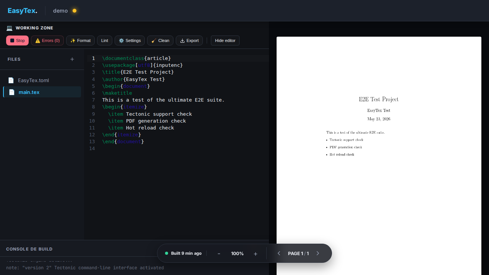

# EasyTex

EasyTex is a single-binary and asynchronous Rust application for compiling and previewing local LaTeX projects through a browser UI or your IDE. It watches project files, compiles LaTeX automatically, serves the latest successful PDF preview, and exposes a small web interface for source editing, build logs, SyncTeX navigation, and build downloads. It is designed for local, low-friction writing workflows that need fast preview feedback without a separate watcher setup.



The frontend assets are embedded into the Rust binary at build time, so deploying EasyTex only requires the `easytex` executable plus the external LaTeX/runtime tools used for the LaTeX compilation.

## What It Does

- Serves a project dashboard and editor UI from one Rust binary.
- Watches project directories with `notify` and triggers builds when relevant files change.
- Compiles LaTeX projects with `tectonic` by default, or `latexmk` when built with the `latexmk` feature.
- Streams build status, logs, diagnostics, file changes, and PDF reload events to the browser using Server-Sent Events.
- Serves PDF previews using PDF.js in the browser.
- Allows editing project source files from the UI.
- Supports manual build, cancel, clean, formatting, PDF export, and download of recent successful builds.
- Supports SyncTeX-based PDF-to-source and source-to-PDF navigation when `synctex` data is available.
- Keeps build artifacts in per-project `build/runs` directories.

## Runtime Model

EasyTex serves a root directory containing one or more LaTeX projects. A project is recognized when it contains an `EasyTex.toml` file.

Typical layout:

```text
projects/
  paper/
    EasyTex.toml
    main.tex
    sections/
      intro.tex
  notes/
    EasyTex.toml
    main.tex
```

Each build runs in a per-project run directory:

```text
paper/build/runs/<timestamp>_P   # build in progress
paper/build/runs/<timestamp>_S   # successful build
paper/build/runs/<timestamp>_F   # failed build
```

The PDF preview is selected by scanning for the latest successful run (`*_S`). EasyTex does not require a separate preview pointer file. Failed runs are kept for diagnostics. Cleanup keeps at most 10 run directories while preserving at least three successful runs when available.

## Runtime Dependencies

The `easytex` binary does not include a TeX distribution. External tools must be installed and available in `PATH`.

Required for the default build mode:

- `tectonic`

Required when compiled with `--features latexmk`:

- `latexmk`
- `texfot`

Optional runtime tools:

- `synctex`: enables source/PDF navigation.
- `tex-fmt`: enables formatting from the UI.
- `chktex`: enables linting from the UI.
- `texloganalyser`: improves warning analysis for `latexmk` builds.
- `gs` / Ghostscript: enables optional PDF compression.

## Build Prerequisites

To build EasyTex from source, install:

- Rust and Cargo.
- Bun, for building the browser UI.

Runtime tools such as `tectonic`, `latexmk`, and `texfot` are not needed to compile the binary, but they are required when running the server. Playwright is only required for the E2E test suite.

Use the diagnostic command to check the local environment:

```bash
easytex diag projects
```

The diagnostic checks configuration parsing, runtime tools, root directory readability/writability, history path availability, and whether the configured host/port can be bound.

Print version metadata for automation:

```bash
easytex version --json
```

## Building

Build the browser UI and release binary:

```bash
make build
```

Or run the steps manually:

```bash
cd frontend && bun install && bun run build
cd ..
cargo build --release
```

Build with the `latexmk` backend:

```bash
cargo build --release --features latexmk
```

The build script embeds the already-built `frontend/dist` directory into the Rust binary. It does not install frontend dependencies and does not run the frontend build. If `frontend/dist/index.html` is missing, the Rust build fails with an instruction to build the UI first.

Development notes:

- The backend is written in Rust.
- The browser UI is built from the `frontend/` package and embedded in the binary.
- Rebuild the frontend manually when UI sources change.
- `build.rs` hashes `frontend/dist` and only causes Rust to re-embed assets when the generated distribution changes.

## Running

Serve a directory of projects:

```bash
./target/release/easytex serve projects
```

By default, EasyTex binds to `127.0.0.1:8081`.

Use a custom port:

```bash
./target/release/easytex serve projects --port 9000
```

Bind outside localhost only when needed:

```bash
EASYTEX_ADMIN_TOKEN=<token> ./target/release/easytex serve projects --host 0.0.0.0
```

Open the UI at:

```text
http://localhost:8081
```

## Project Configuration

Each project has an `EasyTex.toml` file:

```toml
entrypoint = "main.tex"
```

Optional formatting command:

```toml
entrypoint = "main.tex"
format_command = "tex-fmt {file}"
```

Entrypoints are restricted to simple `.tex` filenames.

## Server Configuration

Server settings live in `easytex.yaml`. Missing config files are generated with defaults.

```yaml
port: 8081
host: "127.0.0.1"
root_dir: "."
max_concurrent_builds: 4
session_ttl_hours: 24
build_timeout_mins: 15
compress_pdf: true
admin_token: null
require_auth: false
allow_shell_escape: false
cors_allowed_origins: []
history_file: ".easytex-history.json"
max_edit_file_size_bytes: 1000000
max_read_file_size_bytes: 2000000
max_project_files: 5000
max_pdf_size_bytes: 104857600
read_only: false
```

Environment overrides:

- `PORT`: overrides `port`.
- `ROOT_DIR`: overrides `root_dir`.
- `EASYTEX_HOST`: overrides `host`.
- `EASYTEX_ADMIN_TOKEN`: protects `/admin`, `/api/admin/*`, `/api/*`, `/pdf/*`, and `/events/*` when set.
- `EASYTEX_REQUIRE_AUTH`: requires `EASYTEX_ADMIN_TOKEN` even when serving only localhost.
- `EASYTEX_CORS_ALLOWED_ORIGINS`: comma-separated CORS allow-list.
- `EASYTEX_MAX_EDIT_FILE_SIZE_BYTES`: maximum size accepted by the file-edit API.
- `EASYTEX_MAX_READ_FILE_SIZE_BYTES`: maximum size returned by the file-read API.
- `EASYTEX_MAX_PROJECT_FILES`: maximum number of files returned by project listing.
- `EASYTEX_MAX_PDF_SIZE_BYTES`: maximum PDF size served by `/pdf`.
- `EASYTEX_READ_ONLY`: set to `true` or `1` to disable mutating routes and editing controls.

When the frontend is served by EasyTex itself, browser API calls should use same-origin relative URLs such as `/api/projects`, `/pdf/<project>`, and `/events/<project>`. CORS is only needed when a separately served frontend, such as the Vite dev server, calls the backend from another origin.

## HTTP Surface

Primary endpoints:

- `GET /`: browser UI.
- `GET /health`: liveness check.
- `GET /ready`: readiness check.
- `GET /api/projects`: list projects.
- `GET /api/capabilities`: report runtime-enabled optional features.
- `POST /api/create/:name`: create project.
- `POST /api/delete/:name`: delete a project configuration and remove its session.
- `POST /api/run/:name`: start manual build.
- `POST /api/cancel/:name`: cancel active build.
- `GET /api/status/:name`: return build status.
- `POST /api/clean/:name`: remove project build artifacts.
- `POST /api/format/:name`: run the configured formatter.
- `POST /api/lint/:name`: run `chktex` and return stdout/stderr.
- `GET /api/config/:name`: read project config.
- `POST /api/config/:name`: write project config.
- `GET /api/files/:name`: list editable project files with truncation metadata.
- `GET /api/file/:name?path=...`: read file.
- `POST /api/file/:name`: write file.
- `GET /api/preview/:name`: metadata for the latest successful preview.
- `GET /api/builds/:name`: list recent successful builds.
- `GET /api/synctex/:name`: SyncTeX edit/view lookup.
- `GET /pdf/:name`: serve latest successful PDF.
- `GET /pdf/:name?dl=1`: download latest successful PDF.
- `GET /pdf/:name?dl=1&run=<run_id>`: download a specific successful build.
- `GET /events/:name`: Server-Sent Events stream for logs/status/reload events.
- `GET /admin`: basic admin dashboard.
- `GET /api/admin/metrics`: authenticated operational counters.
- `POST /api/admin/kill/:name`: stop and remove an active session.

When `admin_token` is configured or `require_auth` is enabled, all `/api/*`, `/api/admin/*`, `/pdf/*`, and `/events/*` endpoints require `Authorization: Bearer <token>`. The static browser UI remains public so it can prompt for the token.

Mutating `POST` API requests also require the CSRF header `X-EasyTex-Request: true`. The bundled browser UI sends this automatically.

## Build History And Artifacts

EasyTex keeps two forms of history:

- A lightweight JSON history file configured by `history_file`, used by the admin view.
- Per-project build artifacts in `build/runs`.

Run directories are named by timestamp and status suffix:

- `_P`: in progress.
- `_S`: success.
- `_F`: failed.

The UI preview and download list are derived from `_S` directories. Failed builds remain available on disk until cleanup removes them.

## Logging

EasyTex uses `tracing` and reads `RUST_LOG`.

Examples:

```bash
RUST_LOG=info easytex serve projects
RUST_LOG=trace easytex serve projects
```

`trace` includes request headers with sensitive values redacted, plus lower-level watcher details. Build logs shown in the UI are streamed separately over SSE.

## Testing

Run the full production gate, including frontend build, Rust checks, unit tests, and Playwright E2E:

```bash
make tests
```

Run the auth-protected E2E slice locally:

```bash
EASYTEX_E2E_ADMIN_TOKEN=<token> bunx playwright test tests/admin-auth.spec.ts
```

Regenerate the README screenshot:

```bash
bun run screenshot:readme
```

## Security Notes

EasyTex is designed primarily for local or trusted-network use.

- The default bind address is `127.0.0.1`.
- Set `EASYTEX_ADMIN_TOKEN` before exposing EasyTex over a network. Binding outside localhost requires an admin token; API, PDF, and SSE requests must include `Authorization: Bearer <token>` when a token is configured.
- Set `EASYTEX_REQUIRE_AUTH=true` to enforce bearer auth even on localhost.
- Wildcard CORS (`cors_allowed_origins: ["*"]`) requires an admin token.
- In the browser UI, enter the token when prompted or store it in `localStorage` under `easytex_admin_token` when using a protected network deployment. PDF rendering, downloads, and SSE logs use the stored bearer token.
- Keep `allow_shell_escape: false` unless all documents are trusted.
- File and project paths are validated to reduce traversal risk.
- Build processes run in process groups so cancellation can terminate subprocesses.
- Build timeouts are configurable.
- Use a reverse proxy with TLS if exposing EasyTex over a network.
- See `SECURITY.md` for vulnerability reporting and deployment guidance.

For a stricter starting point, copy `easytex.prod.yaml` and set `admin_token` through the `EASYTEX_ADMIN_TOKEN` environment variable.

## Docker

Build the EasyTex executable inside Docker using the same sequence as the GitHub release workflow: install frontend dependencies, build the browser UI, then run `cargo build --release`.

```bash
docker build -f Dockerfile.build --target artifact -t easytex-builder .
docker create --name easytex-bin easytex-builder
mkdir -p dist
docker cp easytex-bin:/out/easytex dist/easytex
docker rm easytex-bin
```

The runtime Docker setup expects a release binary at `target/release/easytex` and mounts `./example` as the served project root.

```bash
make build
EASYTEX_ADMIN_TOKEN=<token> docker compose up --build
```

The container sets `EASYTEX_HOST=0.0.0.0` so the service is reachable through the published Docker port. EasyTex requires `EASYTEX_ADMIN_TOKEN` for this network binding.

## License

MIT
